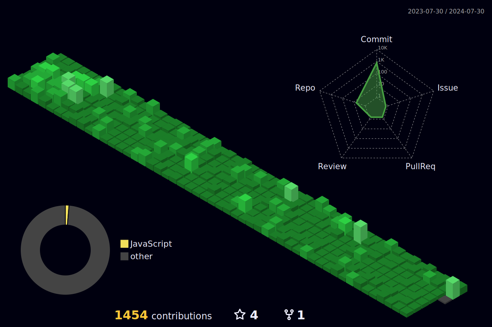

<body>
  

    <h1> Hi there, I'm Wajeeh Haider </h1>
  

  

### 👨💻 MERN Stack Developer at Techfye
<!-- - 🌱 Expanding knowledge in WEB 3.0. -->
- 👯 I’m looking to collaborate with other content creators and developers.
- 📢 Passionate about teaching and inspiring students; taught over 100.
- 🥅 2023-24Goals: Contribute more to Open Source projects and execute innovative ideas.
- 💎 Let's connect if you're a tech enthusiast!  
 
 
  
 
 

  
  
  
  

 
   

 
<h1>Tech Stack  
 </h2>
</h1>

                  

###
 
 

 
 <h2>⚡️GitHub Analytics
 </h2>

<a href="https://github.com/Wajeeh-Haider">
<!--    -->
  
</a>
  

 
	

<!-- ## 🚀Github Metrics

	

  -->

## ⚡️Github Contributions
	
<h4 align="center">Isometric view of contributions in the last year</h4>

	

<h2 >🏆 GitHub Profile Trophy</h2>

 

  

 

